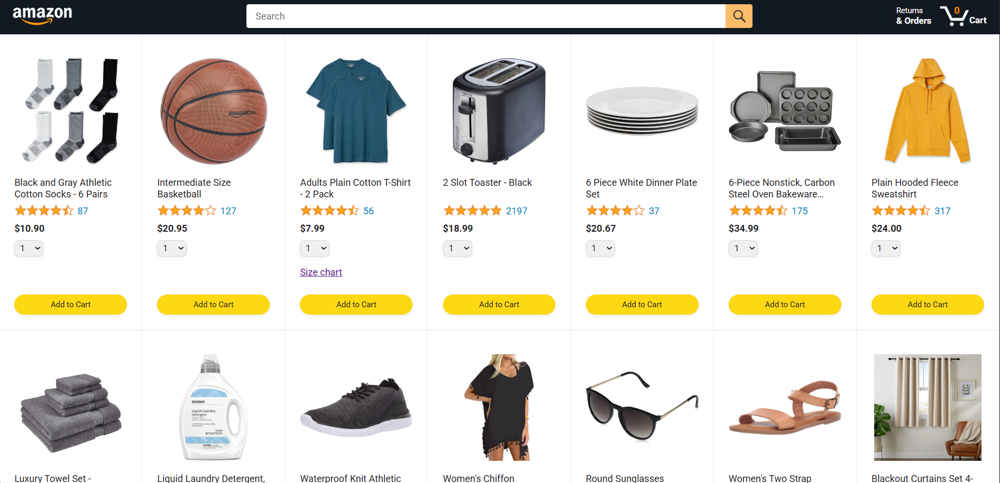
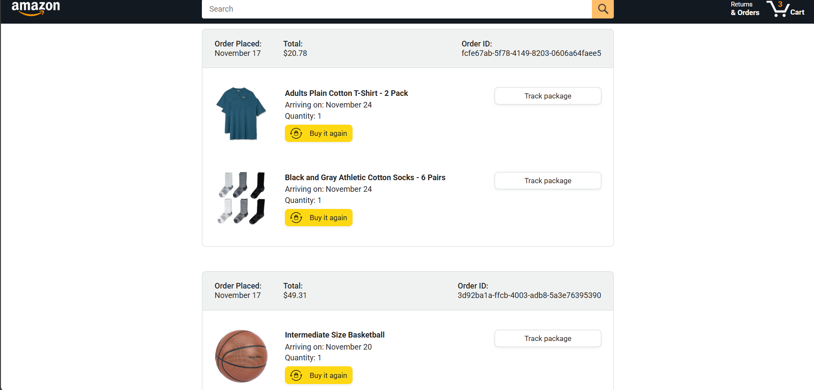
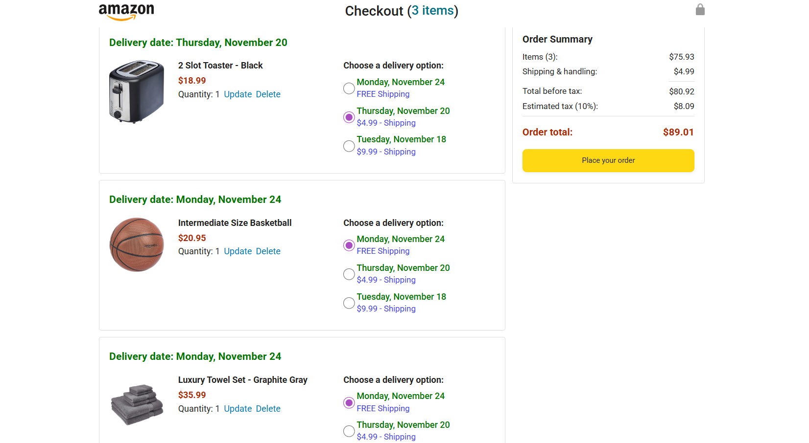
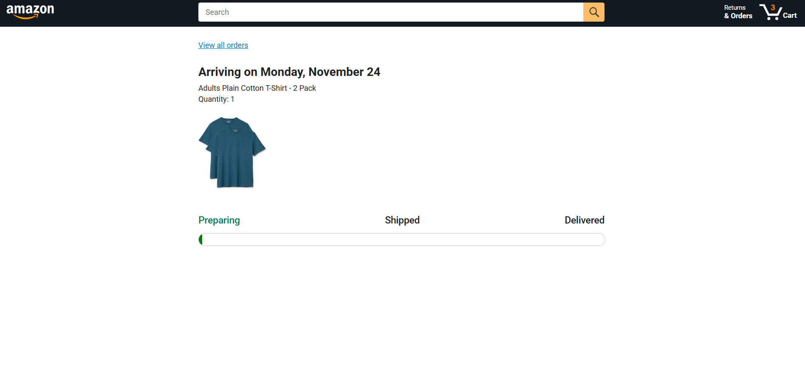

📦 Amazon Clone 
A fully functional Amazon-like shopping interface built using HTML, CSS, and JavaScript.
The project includes dynamic product loading, search, cart management, order page, and order tracking — all powered by a REST API.

🚀 Features
🔍 Product Listing
  . Displays all products dynamically using API
  . Shows ratings, price, sizes (for clothing), and product images
  . “Add to Cart” with quantity selection

🛒 Shopping Cart
  . Add items to cart
  . Increase/decrease quantity
  . Remove items
  . Cart total updates automatically

🔎 Search Functionality
  . Search products by name
  . URL-based search with ?search=...
  . Filters product grid in real-time

📦 Orders Page
  . Shows all previous orders
  . Shows order date, total price, order ID
  . Displays items ordered with quantity & delivery date

🚚 Order Tracking
  . Tracking page shows the shipping progress
  . Uses API data for real tracking states

🔗 Backend (API)
  . Uses supersimple.dev backend for:
     /products
     /cart
     /orders
     /tracking

🛠️ Tech Stack
   . Technology	Purpose
   . HTML	Structure
   . CSS	Styling + Responsive layout
   . JavaScript (ES6+)	All business logic
   . Modules / Classes / OOP	Clean structured code
   . Day.js	Date formatting
   . Fetch API	Load data dynamically

📸 Screenshots
  
  
  
  
